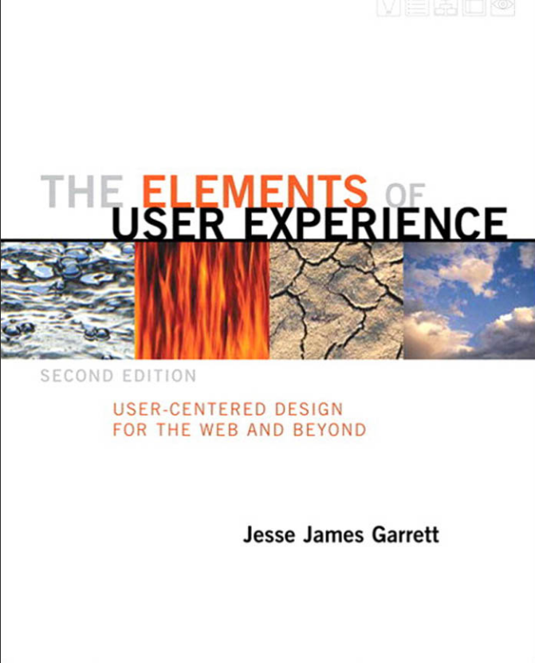

# ux-design-skill

<p align="center">
  
</p>

<p align="center">
  <em>An interactive, plane-by-plane UX coach for AI agents,<br>
  grounded in Jesse James Garrett's <strong>The Elements of User Experience</strong>.</em>
</p>

Instead of one-shot design advice, the agent runs you through the book's five planes — **strategy → scope → structure → skeleton → surface** — asking 3–6 prioritized questions per plane, recording your answers into documents that carry the **book's named artifacts** for each plane, challenging every decision with *"Why did you do it that way?"*, and writing each document before the next plane begins.

**Use it to** design a new product, app, site, or feature; redesign, audit, or improve an existing experience; plan features, content, information architecture, navigation, wireframes, or visual design; or compare implemented code against your UX plans to produce a consolidated issues list.

## Install

This is an Agent Skill: a public GitHub repo with `SKILL.md` at the root. Install it with the [skills CLI](https://skills.sh/docs/cli).

### OpenCode 

Installation:

```bash
npx skills add https://github.com/hector-2710/ux-design-skill --skill ux-design-skill
```


**Manual (OpenCode):** copy this repository into a folder named `ux-design-skill` (must match the skill `name`):

| Scope | Path |
| --- | --- |
| Global | `~/.config/opencode/skills/ux-design-skill/` |
| Project | `.opencode/skills/ux-design-skill/` |


### Other agents (Cursor, Claude Code, Codex, Copilot, …)

The CLI detects installed agents. Target several at once:

```bash
npx skills add Hector-2710/ux-design-skill -a opencode -a cursor -a claude-code -a copilot -a codex
```


Check that the repo resolves before installing:

```bash
npx skills add Hector-2710/ux-design-skill --list
```


In Cursor, invoke with `/ux-design-skill` or ask to design/redesign a product.

## What the skill does

- **Opens with a roadmap summary** — before any design question, it tells you what it will do, plane by plane, and what you'll get.
- **Coaches plane by plane, bottom-up** — strategy (what we want and what users want) → scope (what we build) → structure (how it works) → skeleton (the form it takes) → surface (how it looks and feels). Every plane covers **both the functionality side and the information side**.
- **Generates the book's artifacts, by name** — each plane's document contains the deliverables Garrett defines for that plane (see the table below).
- **Verifies at every gate** — every decision must answer *"Why did you do it that way?"*: traceable to a lower plane, a deliberately chosen convention, or a flagged assumption. Gates pass, pass with back-loops, or block.
- **Never stalls** — anything unknown becomes a **flagged assumption** with a validation hint, not a blocker.
- **Resumes safely** — the docs are the durable memory; every gate is a natural stopping point, and you pick up later exactly where you left off.

## When to use it — and when not

**Use it when you want to:**

- Design a new product, app, site, or feature.
- Redesign, audit, or improve an existing experience.
- Define UX strategy, scope, structure, skeleton, or surface.
- Plan features, content, information architecture, navigation, UI/wireframes, or visual design.
- Compare implemented code against your UX plans to produce a consolidated `ux/issues.md`.

**Skip it when:**

- You want single-step, one-off advice — a color choice, a button label, "make this page nicer" — rather than a plane-by-plane session.
- The work is visual/UI design only, with no strategy/scope/structure context: this method builds bottom-up, and every later plane traces to the planes below it.

## What you will produce

Written into a `ux/` folder in your working directory (configurable), one document per plane — each carrying the book's named artifacts:

| Document | Contains |
| --- | --- |
| `ux/session.md` | Running state (mode, per-plane status, back-loop queue) — pause and resume without losing decisions |
| `ux/strategy.md` | **Product objectives** (with conditions for success), **user needs** (segments, personas, research basis), **brand identity & success metrics** |
| `ux/scope.md` | **Functional specifications** (written per the book's four rules), **content requirements** (format, size, owner, update frequency, audience), **prioritization, out-of-scope list, constraints** |
| `ux/structure.md` | **Interaction design** (conceptual model, error-handling ladder), **information architecture** (nodes, organizing principles, controlled vocabulary), **the architecture diagram** (text form) |
| `ux/skeleton.md` | **Interface design** (elements, defaults), **navigation & information design** (systems, wayfinding, grouping), **standard screens sketched as wireframes** |
| `ux/surface.md` | **Visual design** (eye path, contrast, readability), **design comps** (mapped 1:1 to wireframes), **the style guide** (palette, typography, grid, logo) |
| `ux/issues.md` | A final consolidated issues list comparing your plans against your code — the implementer's handoff brief (fixing the code is out of scope) |

## How a session runs

1. **Roadmap summary** — the skill opens by telling you the whole journey: the five planes, the artifacts, one-plane-per-session, and where everything gets saved.
2. **Intake** — mode detection (new / redesign / both), optional import of your existing materials (PRD, spec, design system, mockups, analytics) with provenance, and where to write the docs.
3. **The plane loop** — per plane: a few prioritized questions → your answers become decisions → missing data degrades to flagged assumptions, never blockers.
4. **The gate** — the plane's document is saved, every decision is challenge-checked, and the gate passes, passes with back-loops, or blocks on a contradiction. Each gate is a natural stopping point.
5. **Closing review + code pass** — after surface, a cross-plane consistency review you approve, then (optionally) a code-comparison pass that produces `ux/issues.md` and hands off.

## How it honors Garrett's book

Every rule in this skill traces to the book: five planes built bottom-up with **bidirectional ripple** (p. 22–24); every plane split into a **functionality side and an information side** (p. 25–31); every decision challenged with **"Why did you do it that way?"** (p. 157); the pacing is a **marathon, not a sprint** (p. 159–161) — you never build the roof before the shape of its foundation is known. The per-plane artifacts follow the book's deliverable language: the strategy document (p. 53), functional specifications and content requirements (p. 62–74), the architecture diagram (p. 101), wireframes (p. 128–130), and the design comps and style guide (p. 148–151).

## Prerequisites

- **Product context.** You should be able to describe your product, your users, and the outcome you want — the skill will ask about them, plane by plane. You don't need design expertise; the skill supplies the method.
- **Time.** Sessions run one plane at a time by default, so expect a few focused sessions rather than one long run. Each plane is a natural stopping point, and you can resume later from your saved documents.


## License

MIT — see [LICENSE](LICENSE).
